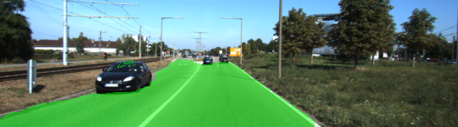
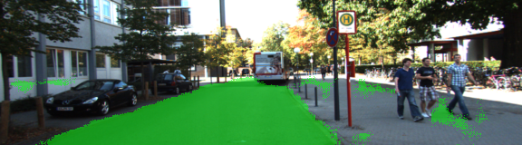

Write-up





1. Loading
The vgg pretrained model is loaded using tf.get_default_graph() and get_tensor_by_name() in load_vgg()

2. Layers
The decoder that learns the correct features is built in layers using tf.layers.conv2d for 1x1 convolutions, tf.layers.conv2d_transpose for the deconvolutions, and tf.add for the skip layers.

3. Optimize
In optimize, the cross_entropy_loss is defined and AdamOptimizer is chosen as optimizer.

4. Training
We train in batches using get_batches_fn and Session::run in train_nn() and the Loss is printed in os stream

5. Loss
The loss decreases to 0.0332 in the final epoch from 137.1797 in the beginning.

6. Hyperparameters
The configuration used (cfg in lone 27) is:
```
    "data_dir" : './data',
    "runs_dir" : './runs',

    "image_shape" : (160, 576),
    "num_classes" : 2,
    "keep_prob" : 0.5,
    "epochs" : 50,
    "learning_rate" : 0.001,
    "kernel_regularizer_scale" : 1e-3,
    "batch_size" : batch_size_from_device,

    "kernel_initializer" : tf.contrib.layers.xavier_initializer(),
    "kernel_regularizer" : tf.contrib.layers.l2_regularizer(scale=1e-3)
```
with batch_size_from_device = 4 for GPU and batch_size_from_device = 1 for CPU.

7. Predicition
Most predicitions are collect as sampled in the pictures above.

